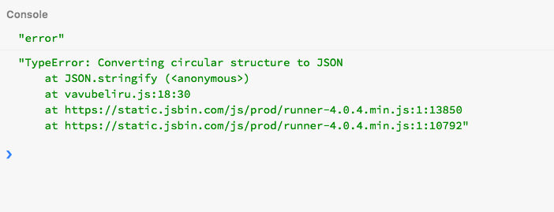

对象是 JavaScript 的基本块。对象是属性的集合，属性是键值对。JavaScript 中的几乎所有对象都是位于原型链顶部 `Object` 的实例。
## 介绍
如你所知，赋值运算符不会创建一个对象的副本，它只分配一个引用，我们来看下面的代码：
```javascript
let obj = {
  a: 1,
  b: 2,
};
let copy = obj;

obj.a = 5;
console.log(copy.a);
// 结果
// copy.a = 5;
```
`obj` 变量是一个新对象初始化的容器。`copy` 变量指向同一个对象，是对该对象的引用。所以现在有两种方式可以访问这个 `{ a: 1, b: 2, }` 对象。你必须通过 `obj` 变量或 `copy` 变量，无论你是通过何种方式对这个对象进行的任何操作都会影响该对象。

不变性（Immutability）最近被广泛地谈论，这个很重要！上面示例的方法消除了任何形式的不变性，如果原始对象被你的代码的另一部分使用，则可能导致bug。

## 复制对象的原始方式
复制对象的原始方法是循环遍历原始对象，然后一个接一个地复制每个属性。我们来看看这段代码：
```javascript
function copy(mainObj) {
  let objCopy = {}; // objCopy 将存储 mainObj 的副本
  let key;

  for (key in mainObj) {
    objCopy[key] = mainObj[key]; // 将每个属性复制到objCopy对象
  }
  return objCopy;
}

const mainObj = {
  a: 2,
  b: 5,
  c: {
    x: 7,
    y: 4,
  },
}

console.log(copy(mainObj));
```
存在的问题
- `objCopy` 对象具有一个新的 `Object.prototype`方法，这与 `mainObj` 对象的原型方法不同，这不是我们想要的。我们需要精确的拷贝原始对象。
- 属性描述符不能被复制。值为 `false` 的 “可写(`writable`)” 描述符在 `objCopy` 对象中为  `true` (当 writable 设置为false时，表示不可写，也就是说属性不能被修改。)。
- 上面的代码只复制了 `mainObj` 的可枚举属性。
- 如果原始对象中的一个属性本身就是一个对象，那么副本和原始对象之间将共享这个对象，从而使其各自的属性指向同一个对象。
```javascript
var o = {}; // Creates a new object

Object.defineProperty(o, 'a', {
  value: 37,
  writable: false
});

console.log(o.a); // logs 37
o.a = 25; // No error thrown
// (it would throw in strict mode,
// even if the value had been the same)
console.log(o.a); // logs 37. The assignment didn't work.

// strict mode
(function() {
  'use strict';
  var o = {};
  Object.defineProperty(o, 'b', {
    value: 2,
    writable: false
  });
  o.b = 3; // throws TypeError: "b" is read-only
  return o.b; // returns 2 without the line above
}());
```
正如上例中看到的，修改一个 non-writable 的属性不会改变属性的值，同时也不会报异常。

## 浅拷贝对象
当拷贝源对象的顶级属性被复制而没有任何引用，并且拷贝源对象存在一个值为对象的属性，被复制为一个引用时，那么我说这个对象被浅拷贝。如果拷贝源对象的属性值是对象的引用，则只将该引用值复制到目标对象。
浅层复制将复制顶级属性，但是嵌套对象将在原始（源）对象和副本（目标）对象之间是共享。
### 使用 Object.assign() 方法
Object.assign() 方法用于将从一个或多个源对象中的所有可枚举的属性值复制到目标对象。
```javascript
let obj = {
  a: 1,
  b: 2,
};
let objCopy = Object.assign({}, obj);
console.log(objCopy);
// Result - { a: 1, b: 2 }
```
到目前为止。我们创建了一个 obj 的副本。让我们看看是否存在不变性：
```javascript
let obj = {
  a: 1,
  b: 2,
};
let objCopy = Object.assign({}, obj);

console.log(objCopy); // result - { a: 1, b: 2 }
objCopy.b = 89;
console.log(objCopy); // result - { a: 1, b: 89 }
console.log(obj); // result - { a: 1, b: 2 }
```
在上面的代码中，我们将 objCopy 对象中的属性 b 的值更改为 89 ，并且当我们在控制台中 log 修改后的 objCopy 对象时，这些更改仅应用于 objCopy 。我们可以看到最后一行代码检查 obj 对象并没有被修改。这意味着我们已经成功地创建了拷贝源对象的副本，而且它没有引用。
### Object.assign()的陷阱
不要高兴的太早！ 虽然我们成功地创建了一个副本，一切似乎都正常工作，记得我们讨论了浅拷贝？ 我们来看看这个例子：
```javascript
let obj = {
  a: 1,
  b: {
    c: 2,
  },
}
let newObj = Object.assign({}, obj);
console.log(newObj); // { a: 1, b: { c: 2} }

obj.a = 10;
console.log(obj); // { a: 10, b: { c: 2} }
console.log(newObj); // { a: 1, b: { c: 2} }

newObj.a = 20;
console.log(obj); // { a: 10, b: { c: 2} }
console.log(newObj); // { a: 20, b: { c: 2} }

newObj.b.c = 30;
console.log(obj); // { a: 10, b: { c: 30} }
console.log(newObj); // { a: 20, b: { c: 30} }

// 注意: newObj.b.c = 30; 为什么呢..
```
`obj.b.c = 30 ?`
这就是 Object.assign() 的陷阱。Object.assign 只是浅拷贝。 newObj.b 和 obj.b 都引用同一个对象，没有单独拷贝，而是复制了对该对象的引用。任何对对象属性的更改都适用于使用该对象的所有引用。我们如何解决这个问题？继续阅读…我们会在下一节给出修复方案。
注意：原型链上的属性和不可枚举的属性不能复制。 看这里：
```javascript
let someObj = {
  a: 2,
}

let obj = Object.create(someObj, {
  b: {
    value: 2,
  },
  c: {
    value: 3,
    enumerable: true,
  },
});

let objCopy = Object.assign({}, obj);
console.log(objCopy); // { c: 3 }
```
`someObj` 是在 `obj` 的原型链，所以它不会被复制。
属性 `b` 是不可枚举属性。
属性 `c` 具有 可枚举(enumerable) 属性描述符，所以它可以枚举。 这就是为什么它会被复制。
## 深度拷贝对象
深度拷贝将拷贝遇到的每个对象。副本和原始对象不会共享任何东西，所以它将是原件的副本。以下是使用 Object.assign() 遇到问题的修复方案。让我们探索一下。
### 使用 JSON.parse(JSON.stringify(object));
这可以修复了我们之前提出的问题。现在 newObj.b 有一个副本而不是一个引用！这是深度拷贝对象的一种方式。 这里有一个例子：
```javascript
let obj = {
  a: 1,
  b: {
    c: 2,
  },
}

let newObj = JSON.parse(JSON.stringify(obj));

obj.b.c = 20;
console.log(obj); // { a: 1, b: { c: 20 } }
console.log(newObj); // { a: 1, b: { c: 2 } } (一个新的对象)
```
### 陷阱
不幸的是，此方法不能用于复制用户定义的对象方法。 见下文。
## 复制对象方法
方法是一个对象的属性，它是一个函数。在以上的示例中，我们还没有复制对象的方法。现在让我们尝试一下，使用我们学过的方法来创建副本。
```javascript
let obj = {
  name: 'scotch.io',
  exec: function exec() {
    return true;
  },
}

let method1 = Object.assign({}, obj);
let method2 = JSON.parse(JSON.stringify(obj));

console.log(method1); //Object.assign({}, obj)
/* result
{
  exec: function exec() {
    return true;
  },
  name: "scotch.io"
}
*/

console.log(method2); // JSON.parse(JSON.stringify(obj))
/* result
{
  name: "scotch.io"
}
*/
```
结果表明，`Object.assign()` 可以用于复制对象的方法，而使用  `JSON.parse(JSON.stringify(obj))` 则不行。
## 复制循环引用对象
循环引用对象是具有引用自身属性的对象。让我们使用已学的复制对象的方法来复制一个循环引用对象的副本，看看它是否有效。
### 使用 JSON.parse(JSON.stringify(object))
让我们尝试使用 `JSON.parse(JSON.stringify(object))`：
```javascript
// 循环引用对象
let obj = {
  a: 'a',
  b: {
    c: 'c',
    d: 'd',
  },
}

obj.c = obj.b;
obj.e = obj.a;
obj.b.c = obj.c;
obj.b.d = obj.b;
obj.b.e = obj.b.c;

let newObj = JSON.parse(JSON.stringify(obj));

console.log(newObj);
```
结果是：

很明显，JSON.parse(JSON.stringify(object)) 不能用于复制循环引用对象。
### 使用 Object.assign()
让我们尝试使用 Object.assign()：
```javascript
// 循环引用对象
let obj = {
  a: 'a',
  b: {
    c: 'c',
    d: 'd',
  },
}

obj.c = obj.b;
obj.e = obj.a;
obj.b.c = obj.c;
obj.b.d = obj.b;
obj.b.e = obj.b.c;

let newObj2 = Object.assign({}, obj);

console.log(newObj2);
```
结果是：

`Object.assign()` 适用于浅拷贝循环引用对象，但不适用于深度拷贝。随意浏览浏览器控制台上的循环引用对象树。我相信你会发现很多有趣的工作在那里。
## 使用展开操作符(…)
ES6已经有了用于数组解构赋值的 rest 元素，和实现的数组字面展开的操作符。看一看这里的数组的展开操作符的实现：
```javascript
const array = [
  "a",
  "c",
  "d", {
    four: 4
  },
];
const newArray = [...array];
console.log(newArray);
// 结果
// ["a", "c", "d", { four: 4 }]
```
对象字面量的展开操作符目前是ECMAScript 的第 3 阶段提案。对象字面量的展开操作符能将源对象中的可枚举的属性复制到目标对象上。下面的例子展示了在提案被接受后复制一个对象是多么的容易。
```javascript
let obj = {
  one: 1,
  two: 2,
}

let newObj = { ...z };

// { one: 1, two: 2 }
```
注意：这将只对浅拷贝有效

## 结论
在 JavaScript 中复制对象可能是相当艰巨的，特别是如果您刚开始使用 JavaScript 并且不了解该语言的方式。希望本文帮助您了解并避免您可能遇到复制对象的陷阱。如果您有任何库或一段代码可以获得更好的结果，欢迎与社区分享。
[原文链接：](https://scotch.io/bar-talk/copying-objects-in-javascript)https://scotch.io/bar-talk/copying-objects-in-javascript

