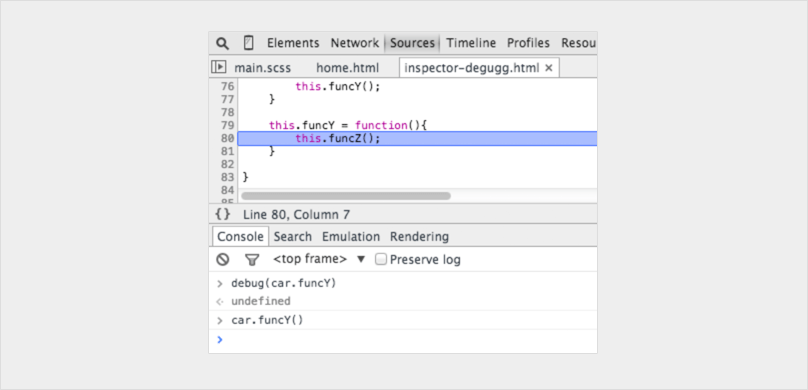

** [文章转载自：你可能不知道的14个JavaScript调试技巧 http://www.css88.com/archives/8468](http://www.css88.com/archives/8468) **

## `‘debugger;’`
除了 `console.log` , `debugger;` 是我们最喜欢、快速且肮脏的调试工具。一旦执行到这行代码，Chrome 会在执行时自动停止。 你甚至可以使用条件语句加上判断，这样可以只在你需要的时候运行。愚人码头注：本人实在觉得这种调试方面很不好，因为后续的调试步骤和断点调试没什么区别。而且调试完成后，还要记住删掉这行代码。确实有点肮脏。
```javascript
if (thisThing) {
    debugger;
}
```
## 将 objects 显示为表格
有时，你有一个复杂的对象要查看。你可以用 `console.log` 查看并滚动浏览该对象，或者使用 `console.table` 展开，更容易看到正在处理的内容！
```javascript
var animals = [
    { animal: 'Horse', name: 'Henry', age: 43 },
    { animal: 'Dog', name: 'Fred', age: 13 },
    { animal: 'Cat', name: 'Frodo', age: 18 }
];
console.table(animals);
```
## 尝试所有的屏幕尺寸
虽然在桌面设备上安装不同移动设备模拟器非常棒，但在现实世界中并不可行。 应该是调整你的可视窗口，而不是替换移动设备？ Chrome为你提供所需的一切。 进入Chrome 开发者调试工具，然后点击 **‘toggle device mode(切换设备模式)’** 按钮。 实时观察窗口变化即可!

## 如何快速找到DOM元素
在 Elements(元素) 面板中标记 DOM 元素，并可以在 console(控制台) 中使用它。Chrome 检测器会保留其历史记录中的最后 5 个元素，以便最终标记的元素显示 $0 ，倒数第二个标记元素 $1 ，依此类推。
如果你按照“item-4”，“item-3”，“item-2”，“item-1”，“item-0”的顺序标记下列项，则可以在控制台中像这样访问DOM节点：

## 使用 `console.time()` 和 `console.timeEnd()` 来标记循环耗时
要确切地知道某段代码需要执行多长时间，尤其是在调试慢循环时，可能会非常有用。您甚至可以通过为该方法分配标签来设置多个定时器。让我们看看它是如何工作的：
```javascript
console.time('Timer1');

var items = [];

for(var i = 0; i < 100000; i++){
   items.push({index: i});
}

console.timeEnd('Timer1');
```
运行结果

## 获取函数的堆栈跟踪信息
你可能知道JavaScript框架，会引入大量代码。
它创建视图触发事件，而且你最终会想知道函数调用是怎么发生的。
因为 JavaScript 不是一个很结构化的语言，有时候很难完整的了解到底 发生了什么 以及 什么时候发生 的。 使用 `console.trace`（(仅仅只是在控制台中跟踪) 可以方便地调试JavaScript 。
假设你现在想看 `car` 实例在第24行调用 `funcZ` 函数的完整堆栈轨迹信息:
```javascript
var car;
var func1 = function() {
    func2();
}
var func2 = function() {
    func4();
}
var func3 = function() {
}
var func4 = function() {
    car = new Car();
    car.funcX();
}
var Car = function() {
    this.brand = ‘volvo’;
    this.color = ‘red’;
    this.funcX = function() {
        this.funcY();
    }
    this.funcY = function() {
        this.funcZ();
    }
    this.funcZ = function() {
        console.trace(‘trace car’)
    }
}
func1();
```
24行将输出：

现在我们可以看到 func1 调用 func2， func2 调用 func4。 Func4 创建了一个 Car 的实例，然后调用函数 car.funcX，依此类推。
即使你认为非常了解自己的代码，这种分析仍然可以让你感到很方便。假如你想改进你的代码。获取跟踪信息和所有涉及的函数名单，每一项都可以点击，你可以在他们之间来回切换。这就像一个特地为你准备的菜单。

## 美化代码使调试 JavaScript 变得简单
有时你可能在生产环境中遇到问题，但是你的source maps没有部署在服务器上。 *不要害怕* 。Chrome 可以将你的 Javascript 文件美化为更易阅读的格式。虽然代码不会像你的真实代码那样有用 – 但至少你可以看到发生了什么。点击检查器中源代码查看器下方的 `{}` 美化按钮即可。


## 快速查找要调试的函数
假设你想在一个函数中设置一个断点。

最常见的两种方法是：
- 在源代码查看器查找到相应的行，并添加一个断点
- 在代码中添加debugger
在这两个解决方案中，您必须在文件中单击以调试特定行。
使用控制台打断点可能不太常见。在控制台中使用 debug(funcName)，当到达传入的函数时，代码将停止。
这个调试方法很快, 但缺点是不适用于私有函数或匿名函数。但除了私有和匿名函数, 这可能是找到调试函数的最快方法。（注意：这个函数和console.debug 函数是不同的东西。）
```javascript
var func1 = function() {
    func2();
};

var Car = function() {
    this.funcX = function() {
        this.funcY();
    }

    this.funcY = function() {
        this.funcZ();
    }
}

var car = new Car();
```
在控制台中输入 `debug(car.funcY)` ，当调用 `car.funcY` 时，脚本将以调试模式停止：


## 屏蔽不相关的代码
现在，我们经常在应用中引入多个库或框架。其中大多数都经过良好的测试且相对没有陷阱。 但是，调试器仍然会进入与调试任务无关的文件。解决方案是屏蔽不需要调试的脚本。当然也可以包括你自己的脚本。[在这篇文章中阅读更多关于调试不相关代码](https://raygun.com/blog/javascript-debugging-with-black-box/)。


## 在复杂的调试过程中寻找重点
在更复杂的调试中，我们有时希望输出很多行。你可以做的事情就是使用更多控制台函数来保持良好的输出结构，例如, `console.log`, `console.debug`, `console.warn`, `console.info`,  `console.error`等等。然后，可以在控制台中快速浏览。但有时候，某些 JavaScrip 调试信息并不是你需要的。现在，可以自己美化调试信息了。在调试 JavaScript 时，可以使用 CSS 并自定义控制台信息：
```javascript
console.todo = function(msg) {
    console.log(‘ % c % s % s % s‘, ‘color: yellow; background - color: black;’, ‘–‘, msg, ‘–‘);
}

console.important = function(msg) {
    console.log(‘ % c % s % s % s’, ‘color: brown; font - weight: bold; text - decoration: underline;’, ‘–‘, msg, ‘–‘);
}

console.todo(“This is something that’ s need to be fixed”);
console.important(‘This is an important message’);
```
输出：

*例如：*
在 `console.log()` 中， 可以用 `%s` 设置字符串，`%i` 设置数字，`%c` 设置自定义样式等等，还有很多更好的 `console.log()` 使用方法。 如果使用的是单页应用框架，可以为视图（view）消息创建一个样式，为模型（models），集合（collections），控制器（controllers）等创建另一个样式。也许还可以像 wlog，clog 和 mlog 一样发挥想象力！
## 观察特定函数的调用及其参数
在 Chrome 控制台中，您可以关注特定的函数。 每次调用该函数时，都会对传入的参数值进行记录。
```javascript
var func1 = function(x, y, z) {
//....
};
```

这是查看哪些参数传递给函数的好方法。 但是我必须说，如果控制台可以告诉我们需要多少参数，那将是一件好事。 在上面的例子中，func1 期望 3个参数，但是只有 2 个参数被传入。如果在代码中没有处理这个参数，它可能导致一个可能的 bug 。
## 在控制台中快速访问元素
在控制台中执行 `querySelector` 一种更快的方法是使用美元符。`$('css-selector')` 将会返回CSS选择器的第一个匹配项。`$$('css-selector')` 将会返回所有匹配项。如果多次使用一个元素，可以把它保存为一个变量。

## Postman 很棒（但Firefox更快）
许多开发人员使用 Postman 查看ajax请求。Postman真的很优秀。但打开一个新的浏览器窗口，新写一个请求对象来测试，这确实显得很麻烦。
有时使用浏览器更容易。
当你使用浏览器查看时，如果请求一个密码验证页面，你不需要担心身份验证的cookie。下面看，在Firefox中如何编辑并重新发送请求。
打开检查员并转到网络选项卡。 右键单击所需的请求，然后选择编辑并重新发送。 现在你可以改变任何你想要的。 更改标题并编辑您的参数并点击重新发送。
下面我用不同的属性提出两次请求：

## 节点变化时中断
DOM 是一个有趣的东西。 有时候它会被修改，但是你并不知道为什么。 但是，当您需要调试 JavaScript 时，Chrome会让您在DOM元素发生更改时暂停。 你甚至可以监视它的属性。 在Chrome 检查器中，右键单击该元素，然后在设置中选择一个中断就可以了：

如果你想更加详细的了解 Chrome DevTools 的使用说明，请查看 Chrome [开发者工具中文文档](http://www.css88.com/doc/chrome-devtools/)
