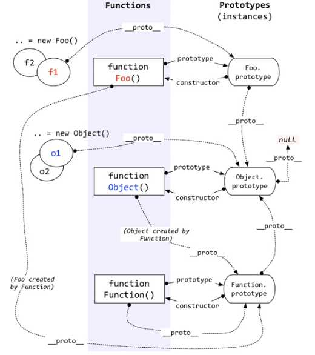

# js中__proto__和prototype的区别和关系
几乎任何对象有一个`prototype`属性，在标准中，这是一个隐藏属性。该属性指向的是这个对象的原型。

1. 通过对象字面量构造对象
```javascript
var person1 = {
    name: 'cyl',
    sex: 'male'
};
```
形如这个形式的叫做对象字面量。这样子构造出的对象，其`prototype`指向`Object.prototype`
2. 构造函数
```javascript
function Person(){}
var person1 = new Person();
```
通过new操作符调用的函数就是构造函数。由构造函数构造的对象，其`prototype`指向其构造函数的`prototype`属性指向的对象。每个函数都有一个`prototype`属性，其所指向的对象带有`constructor`属性，这一属性指向函数自身。（在本例中，person1的[[prototype]]指向Person.prototype）
3. 函数 `Object.create`构造
```javascript
var person1 = {
    name: 'cyl',
    sex: 'male'
};
var person2 = Object.create(person1);
```
本例中，对象person2的`prototype`指向对象person1。在没有`Object.create`函数的日子里，人们是这样做的：
```javascript
Object.create = function(p) {
    function f(){}
    f.prototype = p;
    return new f();
}
```
然而虽然说`prototype`是一个隐藏属性，但很多浏览器都给每一个对象提供`.__proto__`这一属性，这个属性就是上文反复提到的该对象的`prototype`。由于这个属性不标准，因此一般不提倡使用。ES5中用`Object.getPrototypeOf`函数获得一个对象的`prototype`。ES6中，使用`Object.setPrototypeOf`可以直接修改一个对象的`prototype`
某答案说`.__proto__ === .constructor.prototype`是不对的，如果一个对象是通过`Object.create`函数构造出来的，.那其`__proto__`就不一定是`.constructor.prototype`了。


`__proto__`（隐式原型）与`prototype`（显式原型）
是什么
** 显式原型 explicit prototype property：**
每一个函数在创建之后都会拥有一个名为prototype的属性，这个属性指向函数的原型对象。
Note：通过Function.prototype.bind方法构造出来的函数是个例外，它没有prototype属性。
** 隐式原型 implicit prototype link：**
那么一个对象的`prototype`属性究竟怎么决定呢？这是由构造该对象的方法决定的。据我所知有三种构造一个对象的方法：
JavaScript中任意对象都有一个内置属性`prototype`，在ES5之前没有标准的方法访问这个内置属性，但是大多数浏览器都支持通过`__proto__`来访问。ES5中有了对于这个内置属性标准的Get方法`Object.getPrototypeOf()`.
 Note: Object.prototype 这个对象是个例外，它的`__proto__`值为`null`
二者关系
隐式原型指向创建这个对象的函数(`constructor`)的`prototype`
作用是什么
显式原型的作用：用来实现基于原型的继承与属性的共享。
> ECMAScript does not use classes such as those in C++, Smalltalk, or Java. Instead objects may be created in various ways including via a literal notation or via constructors which create objects and then execute code that initialises all or part of them by assigning initial values to their properties. Each constructor is a function that has a property named “prototype” that is used to implement prototype-based inheritance and shared properties.Objects are created by using constructors in new expressions; for example, new Date(2009,11) creates a new Date object. ----ECMAScript Language Specification
隐式原型的作用：构成原型链，同样用于实现基于原型的继承。举个例子，当我们访问obj这个对象中的x属性时，如果在obj中找不到，那么就会沿着`__proto__`依次查找。
> Every object created by a constructor has an implicit reference (called the object’s prototype) to the value of its constructor’s “prototype” ----ECMAScript Language Specification
`__proto__`的指向
__proto__的指向到底如何判断呢？根据ECMA定义 'to the value of its constructor’s "prototype" ' ----指向创建这个对象的函数的显式原型。所以关键的点在于找到创建这个对象的构造函数，接下来就来看一下JS中对象被创建的方式，一眼看过去似乎有三种方式：（1）对象字面量的方式 （2）new 的方式 （3）ES5中的Object.create() 但是我认为本质上只有一种方式，也就是通过new来创建。为什么这么说呢，首先字面量的方式是一种为了开发人员更方便创建对象的一个语法糖，本质就是 var o = new Object(); o.xx = xx;o.yy=yy; 再来看看Object.create(),这是ES5中新增的方法，在这之前这被称为原型式继承，
> 道格拉斯在2006年写了一篇文章，题为 Prototypal Inheritance In JavaScript。在这篇文章中，他介绍了一种实现继承的方法，这种方法并没有使用严格意义上的构造函数。他的想法是借助原型可以基于已有的对象创建新对象，同时还不比因此创建自定义类型，为了达到这个目的，他给出了如下函数:
```javascript
function object(o){
    function F(){}
    F.prototype = o;
    return new F()
}
```
所以从实现代码 return new F() 中我们可以看到，这依然是通过new来创建的。不同之处在于由 Object.create() 创建出来的对象没有构造函数，看到这里你是不是要问，没有构造函数我怎么知道它的__proto__指向哪里呢，其实这里说它没有构造函数是指在 Object.create() 函数外部我们不能访问到它的构造函数，然而在函数内部实现中是有的，它短暂地存在了那么一会儿。假设我们现在就在函数内部，可以看到对象的构造函数是F, 现在
```javascript
//以下是用于验证的伪代码
var f = new F();
//于是有
f.__proto__ === F.prototype //true
//又因为
F.prototype === o;//true
//所以
f.__proto__ === o;
```
因此由Object.create(o)创建出来的对象它的隐式原型指向o。好了，对象的创建方式分析完了，现在你应该能够判断一个对象的`__proto__`指向谁了。
好吧，还是举一些一眼看过去比较疑惑的例子来巩固一下。
- 构造函数的显示原型的隐式原型：
1. 内建对象(built-in object)：比如`Array()`，`Array.prototype.__proto__`指向什么？`Array.prototype`也是一个对象，对象就是由 `Object()` 这个构造函数创建的，因此`Array.prototype.__proto__ === Object.prototype //true`，或者也可以这么理解，所有的内建对象都是由`Object()`创建而来。
自定义对象
1.  默认情况下：
```javascript
function Foo(){}
var foo = new Foo()
Foo.prototype.__proto__ === Object.prototype //true 理由同上
```
2.  其他情况：
(1)
```javascript
function Bar(){}
//这时我们想让Foo继承Bar
Foo.prototype = new Bar()
 Foo.prototype.__proto__ === Bar.prototype //true
```
(2)
```javascript
//我们不想让Foo继承谁，但是我们要自己重新定义Foo.prototype
Foo.prototype = {
  a:10,
  b:-10
}
//这种方式就是用了对象字面量的方式来创建一个对象，根据前文所述
Foo.prototype.__proto__ === Object.prototype
```
注： 以上两种情况都等于完全重写了Foo.prototype，所以Foo.prototype.constructor也跟着改变了，于是乎constructor这个属性和原来的构造函数Foo（）也就切断了联系。
**  构造函数的隐式原型 **
既然是构造函数那么它就是Function（）的实例，因此也就指向Function.prototype,比如 Object.__proto__ === Function.prototype

instanceof
instanceof 操作符的内部实现机制和隐式原型、显式原型有直接的关系。instanceof的左值一般是一个对象，右值一般是一个构造函数，用来判断左值是否是右值的实例。它的内部实现原理是这样的：
```javascript
//设 L instanceof R
//通过判断
 L.__proto__.__proto__ ..... === R.prototype ？
//最终返回true or false
```
也就是沿着L的`__proto__`一直寻找到原型链末端，直到等于`R.prototype`为止。知道了这个也就知道为什么以下这些奇怪的表达式为什么会得到相应的值了
```javascript
Function instanceof Object // true
 Object instanceof Function // true
 Function instanceof Function //true
 Object instanceof Object // true
 Number instanceof Number //false
```


作者：苏墨橘
链接：https://www.zhihu.com/question/34183746/answer/59043879
来源：知乎
著作权归作者所有。商业转载请联系作者获得授权，非商业转载请注明出处。

作者：郑航
链接：https://www.zhihu.com/question/34183746/answer/58068402
来源：知乎


