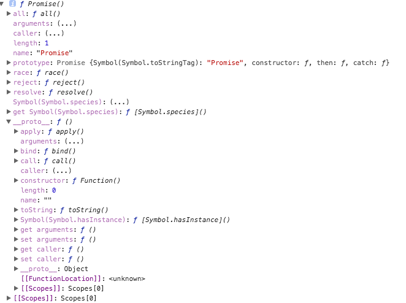

[原文地址](https://www.cnblogs.com/lvdabao/p/es6-promise-1.html)
## Promise 是啥
```javascript
console.dir(Promise);
```

简单粗暴狠的看一眼，其实他就是一个构造函数，输出后能看到我们将会用到的 `all` `race` `reject` `reject` `reject` 的方法。原型链上有 `catch` `then` 我们会用到的方法。
## 直接运行一个
Promise 构造函数接收两个参数 resolve，reject，分别表示异步操作执行成功后的回调函数和异步操作失败后的回调函数。
这里用成功和失败描述并不准确，按照标准来讲，resolve 是将 Promise 的状态置为 fullfiled，
reject 是将 Promise 的状态置为 rejected。
```javascript
var p = new Promise(function(resolve,reject){
    setTimeout(function(){
        console.log('执行完成');
        resolve('随便点什么数据');
    },2000)
})
```
上面的代码执行了异步操作，并且调用 resolve 方法,代码运行 2 秒后输出“执行完成”。注意！这里只是 new 了一个对象，并没有调用它，我们传进去的函数就已经执行了，这是需要注意的一个细节。所以我们用 Promise 的时候一般是抱在一个函数中，在需要运行的时候去运行这个函数(要不然你怎么调用)。
```javascript
function runAsync(){
    var p = new Promise(function(resolve,reject){
        // 做一些异步操作
        setTimeout(function(){
            console.log('执行完成');
            resolve('随便什么数据');
        },2000)
    })
    return p;
}
runAsync();
```
** 现在的疑问点是 **
1. 包装这么一个函数有什么意义
2. resolve('随便什么数据') 的用途是啥
我们包装好这个函数之后，会 return 出 promise 对象，也就是说我们执行这个函数，我们得到一个 Promise 对象。这个 Promise 对象上有 then、catch 方法。
## then() 的用法
```javascript
runAsync().then(function(data){
    console.log(data);
    // 后面用传过来的数据做其它操作
    // ...
})
```
`runAsync` 的返回上直接调用 `then` 方法，`then` 接收一个函数作为参数，并且会拿到我们在 `runAsync` 中调用的 `resolve` 时传的参数，运行这段代码，两秒后输出“执行完成”，紧接着输出“随便什么数据”。

`then` 里面的函数就是我们平时回调函数的意思，能够在 `runAsync` 这个异步任务执行完成之后被执行。这就是 `Promise` 的作用了，简单来讲就是能把原来的回调写法分离出来，在异步操作执行完后，用链式调用的方式执行回调函数。
让我们回顾一下传统 `callback` 写法，不用 `Promise` 的写法。
```javascript

// 回调函数就是一个通过函数指针调用的函数。如果你把函数的指针（地址）作为参数传递给另一个函数，当这个指针被用来调用其所指向的函数时，我们就说这是回调函数。回调函数不是由该函数的实现方直接调用，而是在特定的事件或条件发生时由另外的一方调用的，用于对该事件或条件进行响应。
function runAsync(callback){
    setTimeout(function(){
        console.log('执行完成');
        callback('随便什么数据')
    },2000)
}

runAsync(function(data){
    console.log(data);
})
```
看似效果是一样的，还费劲用 `Promise` 干嘛。那么问题来了，有多层回调该怎么办？如果 `callback` 也是一个异步操作，而且执行完后也需要有相应的回调函数怎么办？总不能再定义一个 `callback2`，然后给 `callback` 传进去。而 `Promise` 的优势在于，
可以在 `then` 方法中继续写 `Promise` 对象并返回，然后继续调用 `then` 来进行回调操作。

** 用于链式操作的优雅 **
从表面看，Promise 是能简化层层回调的写法，而实质上，Promise 的实质是“状态”，用维护状态、传递状态的方式来使得回调函数能够及时调用，它比传递 callback 函数要简单、灵活。
所以下面是使用场景。
```javascript
function runAsyn1(){
    var p = new Promise(function(resolve,reject){
        setTimeout(function(){
            resolve('随便点数据1');
        },2000);
    })
    return p;
}
function runAsyn2(){
    var p = new Promise(function(resolve,reject){
        setTimeout(function(){
            resolve('随便点数据2');
        },2000);
    })
    return p;
}

runAsyn1().then(function(data){
    console.log(data);
    return runAsyn2();
    // 这里也可以直接使用 return '直接返回数据';
}).then(function(data){
    console.log(data);
})
```
## reject 的用法
reject 就是把 Promise 的状态置为 rejected，这样我们在 then 中就能捕捉到，然后执行“失败”情况的回调。
```javascript
function getNumber(){
    var p = new Promise(function(resolve,reject){
        // 做一些异步操作
        setTimeout(function(){
            var num = Math.ceil(Math.random() * 10);// 生成 1 到 10 的随机数
            if(num < 5){
                resolve(num);
            }else{
                reject('数字太大了');
            }
        },2000)
    });
    return p;
}

getNumber().then(function(data){
    console.log('resolved')
},function(reason,data){
    console.log('rejected');
    console.log(reason);
})
```
`getNumber` 函数用来异步获取一个数字，两秒后执行完成，如果数字小于等于5，我们认为是成功了，调用 resolve 修改 Promise 的状态，否则我们认为是“失败”了，调用reject并传递一个参数，作为失败原因。运行 getNumber 并且在 then 中传了两个参数， then 方法可以接受两个参数，第一个对应的 resolve 的回调，第二个对应 reject 的回调。

## catch 的用法
catch 和 then 中传入的第二个参数一样，用来指定 reject 的回调，用法如下。
```javascript
getNumber().then(function(data){
    console.log('resolved');
    console.log(data);
}).catch(function(reason,data){
    console.log('rejected');
    console.log(reson);
})
```
** 和两个参数写在一起有什么区别呢？ **
在执行resolve的回调（也就是then中的第一个参数）时，如果抛出异常（代码出错），
那么并不会报错卡死，而是会进入到这个 catch 方法中。
```javascript
getNumber()
.then(function(data){
    console.log('resolved');
    console.log(data);
    console.log(somedata); //此处的somedata未定义
})
.catch(function(reason){
    console.log('rejected');
    console.log(reason);
});
```
在`resolve`的回调中，我们`console.log(somedata)`;而`somedata`这个变量是没有被定义的。如果我们不用`Promise`，代码运行到这里就直接在控制台报错了，不往下运行了。但是在这里，会正常运行。
也就是说进到`catch`方法里面去了，而且把错误原因传到了reason参数中。即便是有错误的代码也不会报错了，这与我们的try/catch语句有相同的功能。

## all 的用法
`Promise` 的`all`方法提供了并行执行异步操作的能力，并且在所有异步操作执行完后才执行回调。
```javascript
Promise.all([runAsyn(),runAsyn1(),runAsyn2()]).then(function(results){
    console.log(results);
})
```
用`Promise.all`来执行，all接收一个数组参数，里面的值最终都算返回`Promise`对象。这样，三个异步操作的并行执行的，等到它们都执行完后才会进到then里面。那么，三个异步操作返回的数据哪里去了呢？都在`then`里面呢，
`all`会把所有异步操作的结果放进一个数组中传给then，就是上面的`results`。

有了`all`，你就可以并行执行多个异步操作，并且在一个回调中处理所有的返回数据，是不是很酷？有一个场景是很适合用这个的，一些游戏类的素材比较多的应用，打开网页时，预先加载需要用到的各种资源如图片、flash以及各种静态文件。所有的都加载完后，我们再进行页面的初始化。(万一有一个跑不完？)

## `race` 的用法
`all`方法的效果实际上是「谁跑的慢，以谁为准执行回调」，那么相对的就有另一个方法「谁跑的快，以谁为准执行回调」，这就是race方法，这个词本来就是赛跑的意思。`race`的用法与`all`一样，我们把上面`runAsync1`的延时改为1秒来看一下：
```javascript
Promise
.race([runAsync1(), runAsync2(), runAsync3()])
.then(function(results){
    console.log(results);
});
```
这三个异步操作同样是并行执行的。结果你应该可以猜到，1秒后runAsync1已经执行完了，此时then里面的就执行了。结果是这样的：
你猜对了吗？不完全，是吧。在then里面的回调开始执行时，runAsync2()和runAsync3()并没有停止，仍旧再执行。于是再过1秒后，输出了他们结束的标志。

这个`race`有什么用呢？使用场景还是很多的，比如我们可以用`race`给某个异步请求设置超时时间，并且在超时后执行相应的操作，代码如下：
```javascript
//请求某个图片资源
function requestImg(){
    var p = new Promise(function(resolve, reject){
        var img = new Image();
        img.onload = function(){
            resolve(img);
        }
        img.src = 'xxxxxx';
    });
    return p;
}

//延时函数，用于给请求计时
function timeout(){
    var p = new Promise(function(resolve, reject){
        setTimeout(function(){
            reject('图片请求超时');
        }, 5000);
    });
    return p;
}

Promise
.race([requestImg(), timeout()])
.then(function(results){
    console.log(results);
})
.catch(function(reason){
    console.log(reason);
});
```
requestImg函数会异步请求一张图片，我把地址写为"xxxxxx"，所以肯定是无法成功请求到的。timeout函数是一个延时5秒的异步操作。我们把这两个返回Promise对象的函数放进race，于是他俩就会赛跑，如果5秒之内图片请求成功了，那么遍进入then方法，执行正常的流程。如果5秒钟图片还未成功返回，那么timeout就跑赢了，则进入catch，报出“图片请求超时”的信息。运行结果如下：
## 总结
文中没有提到 `done`、`finally`、`success`、`fail`等，这些是啥？这些并不在Promise标准中，而是我们自己实现的语法糖。
本文中所有异步操作均以`setTimeout`为例子，之所以不使用`ajax`是为了避免引起混淆，因为谈起ajax，很多人的第一反应就是jquery的ajax，而jquery又有自己的Promise实现。如果你理解了原理，就知道使用setTimeout和使用ajax是一样的意思。说起jquery，我不得不吐槽一句，jquery的Promise实现太过垃圾，各种语法糖把人都搞蒙了，我认为Promise之所以没有全面普及和jquery有很大的关系。后面我们会细讲jquery。
最后补充一个 Promise 的 ajax 数据请求。
```javascript
const getJSON = function(url) {
  const promise = new Promise(function(resolve, reject){
    const handler = function() {
      if (this.readyState !== 4) {
        return;
      }
      if (this.status === 200) {
        resolve(this.response);
      } else {
        reject(new Error(this.statusText));
      }
    };
    const client = new XMLHttpRequest();
    client.open("GET", url);
    client.onreadystatechange = handler;
    client.responseType = "json";
    client.setRequestHeader("Accept", "application/json");
    client.send();

  });

  return promise;
};

getJSON("/posts.json").then(function(json) {
  console.log('Contents: ' + json);
}, function(error) {
  console.error('出错了', error);
});
```
