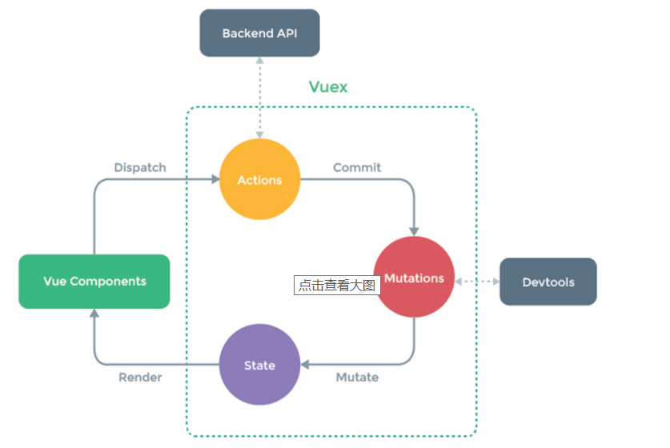

# 面试题回顾
## 实现 object.set('a','b') 和object.get('a')方法
### 实现方法一
```javascript
var hashMap = {
    set: function(key,value) {
        this[key] = value;
    },
    get: function(key) {
        return this[key];
    },
    contains: function(key) {
        return this.get(key) == null ? false : true;
    },
    remove: function(key) {
        delete this[key];
    }
};
```
### 第二中方法，ES6
```javascript
const m = new Map();
      m.set('a', 1);
console.log(m.get('a'));
```
### 第三种方法,构造函数方法
```javascript
function People(key,value){
        this.name = {};
        var len = arguments.length;
        this.getName = function(key){
            return this[key];
        }
        this.setName = function(key,value){
            var str = '{"'+ key + '":"' + value + '"}';
            _this.name = JSON.parse(str);
        };
}

People('a','b')

console.log(People.name);
```
JSON.parse 可以做更多的事情 [MDN](https://developer.mozilla.org/zh-CN/docs/Web/JavaScript/Reference/Global_Objects/JSON/parse);

## 理解 setTimeout 是 window 对象的方法
setTimeout的常见用法是让某个方法延迟执行。setTimeout方法是挂在window对象下的。《JavaScript高级程序设计》第二版中，写到：“超时调用的代码都是在全局作用域中执行的，因此函数中this的值在非严格模式下指向window对象，在严格模式下是undefined”。在这里，我们只讨论非严格模式。
setTimeout接受两个参数，第一个是要执行的代码或函数，第二个是延迟的时间。
```javascript
var obj = {
    name: 'aaaa',
    getName: function() {
        // console.log(this);
        alert(this.name);
    },
    testGet: function() {
        // console.log(this);
        setTimeout(this.getName, 0); // 这里的 js 指向就是 window 了，因此就是 undifined
    }
};
obj.testGet();
```
再来看看下面的输出顺序
```javascript
    console.log('a');
    setTimeout(console.log('b'),0); // 会被延迟执行函数中调用
    console.log('c');
```
## 循环的问题
```html
    <ul id="lst">
        <li>11111</li>
        <li>22222</li>
        <li>33333</li>
        <li>44444</li>
        <li>55555</li>
    </ul>
```
```javascript
var li = document.querySelector("#lst").querySelectorAll('li');
var len = li.length;
/*
所有的事件绑定都是异步编程（绑定的时候方法并没有执行），当触发点击事件，执行方法的时候，循环早就结束了。
同步：js 中当前的这个认为没有完成，下面的任务不会执行


*/

// 第一种方案，通过闭包
for(var i = 0;i<len;i++){
    (function(i){
        li[i].onclick = function(){
            console.log(i);
        }
    })(i)
}
// 第二种方案，将执行函数写到外面
function getConsoleLog(i){
    li[i].onclick = function(){
        console.log(i);
    }
}

for(var i = 0 ; i<len ; i++){
    getConsoleLog(i);
}
// 第三种方案，foreach
var node = document.querySelectorAll('ul li')
Array.from(node).forEach(function(nodeItem,index){
    nodeItem.addEventListener('click',function(){
        alert('click'+index)
    })
})
// 第四种方案，ES6
for(let i = 0;i <len; i++){
    li[i].onclick = () => console.log(i); // 因为每一次的 i 都是新的
}

```
## 写一个mul函数，使用方法如下，使用方法如下 mul(2)(3)(4) output:24 mul(4)(3)(4) output:48
```javascript
// ES 5
function mul(x){
    return function(y){
        return function(z){
            return x * y * z;
        }
    }
}
console.log(mul(2)(3)(4));
```
```javascript
// ES 6
let mul = x =>(y)=>(z) => x*y*z;
console.log(mul(2)(3)(4));
```
- 函数是一等公民
- 函数可以有属性，并且能连接到它的构造方法
- 函数可以像一个变量一样存在内存中
- 函数可以当做参数传给其他函数
- 函数可以返回其他函数

## 判断一个 object 是否是数组（array）
```javascript
    // 判断一个对象是否是数组
    // Object.prototype.toString 来判断是否是数组
    function isArray(obj){
        console.log(Object.prototype.toString.call(obj))
        return Object.prototype.toString.call(obj) === '[object Array]';
    }
    isArray({a:'b'});
    isArray('a');
    isArray(['1',2]);
```
```javascript
    // 使用原型链来完成判断
    function isArray(obj){
        console.log(obj.__proto__);
        console.log(Array.prototype);
        return obj.__proto__ === Array.prototype;
    }
    isArray({a:'b'});
    isArray('a');
    isArray(['1',2]);
```
## 操作 object 属性
```javascript
    // delete 是针对 object 属性操作的，x 并不是对象的属性，delete 操作符不起作用
    var output = (function(x){
        delete x;
        return x;
    })(0)
    console.log(output);

    // delete 不能删除 prototype 继承的属性
    var Employee = {
        company : 'xyz'
    }

    var emp1 = Object.create(Employee); // 通过 prototype 继承 company，delete 操作不了 prototype 的属性
    delete emp1.company;
    console.log(emp1.company);

    // 用 delete 操作一个数组中的元素，这个位置会变成占位符
    var trees = ['redwood','bay','oak','maple'];

    delete trees[1];

    console.log(trees[1]); // 返回 undefined ,数组长度不变
```
## instanceof 操作符
```javascript
function foo(){
    return foo;
}
console.log(new foo() instanceof foo); //构造函数不需要 return，如果return的话也是 return this
```
## 怎么计算关联数组长度
```javascript
var counterArray = {
    A : 3,
    B : 4
};
counterArray["C"] = 1;
Object.keys(counterArray).length // Output 3
```
## 实现 var arr = [1,2,3,[4,5,6]...]转成 [1,2,3,4,5,6,...]
```javascript
var _temArr = [];
function arryOneleve(arr){
    for(var item in arr){
        if((typeof arr[item]) != 'object'){
            _temArr.push(arr[item]);
        }else{
            arryOneleve(arr[item]);
        }
    }
    return _temArr;
}

console.log(arryOneleve([[4,5,6],1,2,3]));

// ES6
let _tempArr = [];
let arryCovert = (arr) => {
    for(let item in arr){
        if((typeof arr[item]) != 'object'){
            _tempArr.push(arr[item]);
        }else{
            arryCovert(arr[item]);
        }
    }
    //return _tempArr;
}

arryCovert([1,2,3,[4,5,6]]);
console.log(_tempArr);
```
看似烟花缭乱，其实有更简单的办法
```javascript
console.log([1,2,3,[4,5,6]].toString());
```
## String/Number 类型转化
```javascript
console.log(typeof ('11' + 2 - '1')); // 有减号出现就是 number 类型了

```
## 数组操作
```javascript
// 数组合并
var stringArray = ['This', 'is', 'Baidu', 'Campus'];
alert(stringArray.join(' '));
// foo="get-element-by-id" 转换成驼峰
function convertToCamel(str){
    var arr = str.split('-');
    console.log(arr);
    for(var i = 0; i < arr.length ;i++){
        if(i != 0){
            arr[i] = arr[i].charAt(0).toUpperCase() + arr[i].substr(1,arr[i].length-1);
        }
    }
    return arr.join('');
}
console.log(convertToCamel("get-element-by-id"));
```
## 排序的坑
```javascript
let numberArr = [7,8,1,2,10,2000];
numberArr.sort(function(a,b){ // sort 默认是按照字符串排序的，sort()方法也是一个高阶函数，它还可以接收一个比较函数来实现自定义的排序。
    return a - b;
});
console.log(numberArr);

// 数组排序
// 冒泡法
function bubbleSort(arr) {
    var temp;
    for(var i= 0;i<arr.length;i++){
        for(var j=i+1;j<arr.length;j++){
            if(arr[i] > arr[j]){
                temp = arr[i];
                arr[i] = arr[j];
                arr[j] = temp;
            }
        }
    }
    return arr;
}
console.log('bubbleSort, ', bubbleSort([3,6,1,2,5]));

// 快速排序
function quickSort(arr) {
    if (arr.length <= 1){return arr};
    var pivotIndex = Math.ceil(arr.length / 2);
    var pivot = arr.splice(pivotIndex,1)[0];
    var left = [];
    var right = [];
    for (var i = 0; i < arr.length; i++){
        if(arr[i] < pivot) {
            left.push(arr[i]);
        }else{
            right.push(arr[i]);
        }
    }
    return quickSort(left).concat([pivot],quickSort(right));
}
console.log('quickSort, ', quickSort([2,3,1]));

```
## 操作键值对
有这样一个URLhttp://item.taobao.com/item.htm?a=1&b=2&c=&d=xxx&e，请写一段JS程序提取URL中的各个GET参数(参数名和参数个数不确定)，将其按key-value形式返回到一个json结构中，如{a:'1', b:'2', c:'', d:'xxx', e:undefined}
```javascript
function formatUrl(str){
    var _result = {};
    var search = str.split('?')[1].split('&');
    for(var item in search){
        var kv = search[item].split('=');
        _result[kv[0]] = kv[1]; // 前面是 key ，后面是 value
    }
    console.log(_result);
    return _result;
}

formatUrl('http://item.taobao.com/item.htm?a=1&b=2&c=&d=xxx&e');
```
## 正则表达式构造函数var reg=new RegExp("xxx")与正则表达字面量var reg=//有什么不同？
答案：当使用RegExp()构造函数的时候，不仅需要转义引号（即\"表示"），并且还需要双反斜杠（即\\表示一个\）。使用正则表达字面量的效率更高。
邮箱的正则匹配/手机的正则表达式匹配
```javascript
var regMail = /^([a-zA-Z0-9_-])+@([a-zA-Z0-9_-])+((.[a-zA-Z0-9_-]{2,3}){1,2})$/;
    var regMobile = /(13\d|14[579]|15\d|17[01235678]|18\d)\d{8}/i;

    console.log(regMobile.test('18610556294'))
    console.log(regMobile.exec('18610556294'))
```
- 正则表达式中的特殊字符
- 字符 含意
- \ 做为转意，即通常在"\"后面的字符不按原来意义解释，如/b/匹配字符"b"，当b前面加了反斜杆后/\b/，转意为匹配一个单词的边界。
- -或-
- 对正则表达式功能字符的还原，如"*"匹配它前面元字符0次或多次，/a*/将匹配a,aa,aaa，加了"\"后，/a\*/将只匹配"a*"。

- ^ 匹配一个输入或一行的开头，/^a/匹配"an A"，而不匹配"An a"
- $ 匹配一个输入或一行的结尾，/a$/匹配"An a"，而不匹配"an A"
- * 匹配前面元字符0次或多次，/ba*/将匹配b,ba,baa,baaa
- + 匹配前面元字符1次或多次，/ba*/将匹配ba,baa,baaa
- ? 匹配前面元字符0次或1次，/ba*/将匹配b,ba
- (x) 匹配x保存x在名为$1...$9的变量中
- x|y 匹配x或y
- {n} 精确匹配n次
- {n,} 匹配n次以上
- {n,m} 匹配n-m次
- [xyz] 字符集(character set)，匹配这个集合中的任一一个字符(或元字符)
- [^xyz] 不匹配这个集合中的任何一个字符
- [\b] 匹配一个退格符
- \b 匹配一个单词的边界
- \B 匹配一个单词的非边界
- \cX 这儿，X是一个控制符，/\cM/匹配Ctrl-M
- \d 匹配一个字数字符，/\d/ = /[0-9]/
- \D 匹配一个非字数字符，/\D/ = /[^0-9]/
- \n 匹配一个换行符
- \r 匹配一个回车符
- \s 匹配一个空白字符，包括\n,\r,\f,\t,\v等
- \S 匹配一个非空白字符，等于/[^\n\f\r\t\v]/
- \t 匹配一个制表符
- \v 匹配一个重直制表符
- \w 匹配一个可以组成单词的字符(alphanumeric，这是我的意译，含数字)，包括下划线，如[\w]匹配"$5.98"中的5，等于[a-zA-Z0-9]
- \W 匹配一个不可以组成单词的字符，如[\W]匹配"$5.98"中的$，等于[^a-zA-Z0-9]。
http://www.jb51.net/article/43190.htm
## 写一个function，清除字符串前后的空格。（兼容所有浏览器）
使用特性检测。
```javascript
if (!String.prototype.trim) {
    String.prototype.trim = function() {
        return this.replace(/^\s+/, "").replace(/\s+$/,"");
    }
}
// test the function
var str = " \t\n test string ".trim();
alert(str == "test string"); // alerts "true"
```
## 生成随机颜色
```javascript
function getRandomColor () {
  let rgb = []
  for (let i = 0 ; i < 3; ++i){
    let color = Math.floor(Math.random() * 256).toString(16)
    color = color.length == 1 ? '0' + color : color
    rgb.push(color)
  }
  return '#' + rgb.join('')
}
```
## 写一个回调函数
```javascript
function getUserInfo(cb) {
    var that = this
    if (this.globalData.userInfo) {
      typeof cb == "function" && cb(this.globalData.userInfo)
    } else {
      //调用登录接口
      wx.getUserInfo({
        withCredentials: false,
        success: function(res) {
          that.globalData.userInfo = res.userInfo
          typeof cb == "function" && cb(that.globalData.userInfo)
        }
      })
    }
  }
// 主函数
mainFunction(function(res){
    //利用回调函数返回的值做事情
})


```
## Javascript中callee和caller的作用？
caller是返回一个对函数的引用，该函数调用了当前函数；
callee是返回正在被执行的function函数，也就是所指定的function对象的正文。
那么问题来了？如果一对兔子每月生一对兔子；一对新生兔，从第二个月起就开始生兔子；假定每对兔子都是一雌一雄，试问一对兔子，第n个月能繁殖成多少对兔子？（使用callee完成）
```javascript
var result=[];
function fn(n){  //典型的斐波那契数列
   if(n==1){
        return 1;
   }else if(n==2){
           return 1;
   }else{
        if(result[n]){
                return result[n];
        }else{
                //argument.callee()表示fn()
                result[n]=arguments.callee(n-1)+arguments.callee(n-2);
                return result[n];
        }
   }
}
```
## 实现一个函数clone，可以对JavaScript中的5种主要的数据类型（包括Number、String、Object、Array、Boolean）进行值复制
- 考察点1：对于基本数据类型和引用数据类型在内存中存放的是值还是指针这一区别是否清楚
- 考察点2：是否知道如何判断一个变量是什么类型的
- 考察点3：递归算法的设计
```javascript
// 方法一：
Object.prototype.clone = function() {
    console.log(this.constructor);
    var o = this.constructor === Array ? [] : {};
    for (var e in this) {
        o[e] = typeof this[e] === "object" ? this[e].clone() : this[e];
    }
    return o;
}
var aa = {1:2}
var bb = aa.clone()
aa[1] = 3;
console.log(aa);
console.log(bb);
//方法二：
/**
 * 克隆一个对象
 * @param Obj
 * @returns
 */
function clone(Obj) {
    var buf;
    if (Obj instanceof Array) {
        buf = []; //创建一个空的数组
        var i = Obj.length;
        while (i--) {
            buf[i] = clone(Obj[i]);
        }
        return buf;
    } else if (Obj instanceof Object) {
        buf = {}; //创建一个空对象
        for (var k in Obj) { //为这个对象添加新的属性
            buf[k] = clone(Obj[k]);
        }
        return buf;
    } else { //普通变量直接赋值
        return Obj;
    }
}
var cc = clone(9)
console.log(cc);
```
## 倒计时
```javascript
function test(){
    var t = 60;
    var div = document.querySelector('div');
    div.innerHTML = t.toString();

    var interval = setInterval(del,1000); // 函数内部定义计时器

    function del(){
        if(t <= 0){
            clearInterval(interval); // 什么时候取消计时器
        }
        else{
            t--;;
            div.innerHTML = t.toString();
        }
    }
}
test()
```
## js 创建表格
```javascript
function creatTable(rowNum,colNum){
    var row = '';
    for(var i = 0; i <rowNum ; i++){
        row += '<tr>';
        for(var j = 0; j < colNum; j++){
            row += '<td>' + '中间位置' + '</td>';
        }
        row += '</tr>';
    }
    var table = document.createElement('table');
    table.innerHTML = row; // 理解 innerHTML
    var wrap = document.getElementById('wrap');
    wrap.appendChild(table)
}
creatTable(10,5)
```
## 网址处理
有这样一个URL：http://item.taobao.com/item.htm?a=1&b=2&c=&d=xxx&e，请写一段JS程序提取URL中的各个GET参数(参数名和参数个数不确定)，将其按key-value形式返回到一个json结构中，如{a:'1', b:'2', c:'', d:'xxx', e:undefined}
```javascript
// 用字符串方法
function formatUrl(str){
    var _result = {};
    var search = str.split('?')[1].split('&');
    for(var item in search){
        var kv = search[item].split('=');
        _result[kv[0]] = kv[1]; // 前面是 key ，后面是 value
    }
    return _result;
}
formatUrl('http://item.taobao.com/item.htm?a=1&b=2&c=&d=xxx&e');

// 使用正则方法
function formatUrlExp(url){
    let reg = /([^&?=]+)=([^&?=]+)/g,
    obj = {}
    url.replace(reg,function(...arg){
        obj[arg[1]] = arg[2]
    })
    return obj;
}
console.log(formatUrlExp('http://item.taobao.com/item.htm?a=1&b=2&c=&d=xxx&e'));
// 输出结果 {a:'1', b:'2', c:'', d:'xxx'} e被舍弃了
```
## JS如何实现面向对象和继承机制
构造器继承，原型继承，混合继承，寄生继承
### 构造器继承
```javascript
function Super(a){
    this.a = a;
    this.func = function(){};
}
function Sub(a){
    Super.call(this,a);
}
var obj = new Sub();
obj{
    a:undefined,
    func:function(){}
}
```
### 原型继承
```javascript
function Super(a){
    this.a = a;
    this.func = function(){};
}
function Sub(){
}
Sub.prototype = new Super();
Sub.prototype.constructor = Sub;
var obj = new Sub();

obj{ __proto__:{ a:undefined, func:function(){},
        constructor:function Sub(){} } }
```
### 混合继承
```javascript
function Super(a){
    this.a = a;
    this.func = function(){};
}
function Sub(a){
    Super.call(this,a);
}
Sub.prototype = new Super();
Sub.prototype.constructor = Sub;
var obj = new Sub();
obj{ a:undefined, func:function(){},
    __proto__:{ a:undefined, func:function(){},
        constructor:function Sub(){} } }
```
### 寄生继承
```javascript
function Super(a){
    this.a = a;
    this.func = function(){};
}
Super.prototype.talk = function(){console.log('talk');}
function Sub(a){
    Super.call(this,a);
}
Sub.prototype = Object.create(Super.prototype);
Sub.prototype.constructor = Sub;
var obj = new Sub();

obj{ a:undefined, func:function(){},
    __proto__:{ constructor:function Sub(){},
        __proto__:{ talk :function(){console.log('talk');}
            constructor:function Super(){}
        }

    }
}
```
##
```javascript
<script type="text/javascript" language="Javascript" src="http://ajax.aspnetcdn.com/ajax/jquery/jquery-1.4.1.min.js "></script>
<script type='text/javascript'>//<![CDATA[
if (typeof jQuery == 'undefined') {
    document.write(unescape("%3Cscript src='/Script/jquery-1.4.1.min.js' type='text/javascript' %3E%3C/script%3E"));
}//]]>
</script>
```


## foo = foo||bar ，这行代码是什么意思？为什么要这样写？
答案：if(!foo) foo = bar; //如果foo存在，值不变，否则把bar的值赋给foo。
短路表达式：作为"&&"和"||"操作符的操作数表达式，这些表达式在进行求值时，只要最终的结果已经可以确定是真或假，求值过程便告终止，这称之为短路求值。

## caller 和 callee 的区别
caller返回一个函数的引用，这个函数调用了当前的函数;callee放回正在执行的函数本身的引用，它是arguments的一个属性
** caller **
caller返回一个函数的引用，这个函数调用了当前的函数。
1. 这个属性只有当函数在执行时才有用
2. 如果在javascript程序中，函数是由顶层调用的，则返回null
functionName.caller: functionName是当前正在执行的函数。
```javascript
var a = function() {
    alert(a.caller);
}
var b = function() {
    a();
}
b();
a();
```
上面的代码中，b调用了a，那么a.caller返回的是b的引用.
如果直接调用a(即a在任何函数中被调用，也就是顶层调用),返回null:
** callee **
callee放回正在执行的函数本身的引用，它是arguments的一个属性
1. 这个属性只有在函数执行时才有效
2. 它有一个length属性，可以用来获得形参的个数，因此可以用来比较形参和实参个数是否一致，即比较arguments.length是否等于arguments.callee.length
3. 它可以用来递归匿名函数。
```javascript
var a = function() {
    alert(arguments.callee);
}
var b = function() {
    a();
}
b();
```
a在b中被调用，但是它返回了a本身的引用.

## 一次完整的HTTP事务是怎样的一个过程
1. 域名解析
2. 发起TCP的3次握手
3. 建立TCP连接后发起http请求
4. 服务器端响应http请求，浏览器得到html代码
5. 浏览器解析html代码，并请求html代码中的资源
6. 浏览器对页面进行渲染呈现给用户

## 用JAVASCRIPT实现静态对象、静态方法和静态属性
```javascript
/****************************************
* 方法一
* 类、方法、属性都为静态类型
* 不能创建实例
*****************************************/
var Time = {
    today: ‘2009-3-8′,
    weather: ‘rain’,
    show: function() {
alert(‘Today is ‘ + this.today);
}
};

//静态对象可直接使用，无需创建实例
alert(‘It is ‘ + Time.weather + ‘ today.’);
Time.show();

//下面的代码会出错，因为静态类不能创建实例
//var t = new Time();
//t.show();

/****************************************
* 方法二
* 普通对象，同时拥有静态和非静态属性、方法
* 可以用实例化
* 注意：
*   1.静态方法/属性使用类名访问
*   2.非静态方法/属性使用实例名访问
*****************************************/
function Person(name) {
//非静态属性
this.name = name;
//非静态方法
this.show = function() {
alert(‘My name is ‘ + this.name + ‘.’);
}
}
//添加静态属性，人都是一张嘴
Person.mouth = 1;
//添加静态方法，哇哇大哭
Person.cry = function() {
alert(‘Wa wa wa …’);
};
//使用prototype关键字添加非静态属性，每个人的牙可能不一样多
Person.prototype.teeth = 32;

//非静态方法必须通过类的实例来访问
var me = new Person(‘Zhangsan’);
//使用非静态方法、属性
me.show();
alert(‘I have ‘ + me.teeth + ‘ teeth.’);
//使用静态方法、属性
Person.cry();
alert(‘I have ‘ + Person.mouth + ‘ mouth.’);
```

# HTML CSS 方面
## 在css/js代码上线之后开发人员经常会优化性能，从用户刷新网页开始，一次js请求一般情况下有哪些地方会有缓存处理？
答案：dns缓存，cdn缓存，浏览器缓存，服务器缓存。
## 一个页面上有大量的图片（大型电商网站），加载很慢，你有哪些方法优化这些图片的加载，给用户更好的体验。
- 图片懒加载，在页面上的未可视区域可以添加一个滚动条事件，判断图片位置与浏览器顶端的距离与页面的距离，如果前者小于后者，优先加载。
- 如果为幻灯片、相册等，可以使用图片预加载技术，将当前展示图片的前一张和后一张优先下载。
- 如果图片为css图片，可以使用CSSsprite，SVGsprite，Iconfont、Base64等技术。
- 如果图片过大，可以使用特殊编码的图片，加载时会先加载一张压缩的特别厉害的缩略图，以提高用户体验。
- 如果图片展示区域小于图片的真实大小，则因在服务器端根据业务需要先行进行图片压缩，图片压缩后大小与展示一致。
## 请用Css写一个简单的幻灯片效果页面
```css
/**HTML**/
div.ani

/**css**/
.ani{
    width:480px;
    height:320px;
    margin:50px auto;
    overflow: hidden;
    box-shadow:0 0 5px rgba(0,0,0,1);
    background-size: cover;
    background-position: center;
    -webkit-animation-name: "loops";
    -webkit-animation-duration: 20s;
    -webkit-animation-iteration-count: infinite;
}
@-webkit-keyframes "loops" {
    0% {
        background:url(http://d.hiphotos.baidu.com/image/w%3D400/sign=c01e6adca964034f0fcdc3069fc27980/e824b899a9014c08e5e38ca4087b02087af4f4d3.jpg) no-repeat;
    }
    25% {
        background:url(http://b.hiphotos.baidu.com/image/w%3D400/sign=edee1572e9f81a4c2632edc9e72b6029/30adcbef76094b364d72bceba1cc7cd98c109dd0.jpg) no-repeat;
    }
    50% {
        background:url(http://b.hiphotos.baidu.com/image/w%3D400/sign=937dace2552c11dfded1be2353266255/d8f9d72a6059252d258e7605369b033b5bb5b912.jpg) no-repeat;
    }
    75% {
        background:url(http://g.hiphotos.baidu.com/image/w%3D400/sign=7d37500b8544ebf86d71653fe9f9d736/0df431adcbef76095d61f0972cdda3cc7cd99e4b.jpg) no-repeat;
    }
    100% {
        background:url(http://c.hiphotos.baidu.com/image/w%3D400/sign=cfb239ceb0fb43161a1f7b7a10a54642/3b87e950352ac65ce2e73f76f9f2b21192138ad1.jpg) no-repeat;
    }
}
```
## 外边距重叠就是margin-collapse
- 两个相邻的外边距都是正数时，折叠结果是它们两者之间较大的值。
- 两个相邻的外边距都是负数时，折叠结果是两者绝对值的较大值。
- 两个外边距一正一负时，折叠结果是两者的相加的和。

## 如何垂直居中一个浮动元素？
```css
// 方法一：已知元素的高宽

#div1{
    background-color:#6699FF;
    width:200px;
    height:200px;

    position: absolute;        //父元素需要相对定位
    top: 50%;
    left: 50%;
    margin-top:-100px ;   //二分之一的height，width
    margin-left: -100px;
    }

//方法二:

  #div1{
    width: 200px;
    height: 200px;
    background-color: #6699FF;

    margin:auto;
    position: absolute;        //父元素需要相对定位
    left: 0;
    top: 0;
    right: 0;
    bottom: 0;
    }
```
## 如何垂直居中一个
```css
//的容器设置如下
#container
{
    display:table-cell;
    text-align:center;
    vertical-align:middle;
}
```
## VUE 面试题
### 请谈谈Vue中的MVVM模式
MVVM全称是Model-View-ViewModel
Vue是以数据为驱动的，Vue自身将DOM和数据进行绑定，一旦创建绑定，DOM和数据将保持同步，每当数据发生变化，DOM会跟着变化。 ViewModel是Vue的核心，它是Vue的一个实例。Vue实例时作用域某个HTML元素上的这个HTML元素可以是body，也可以是某个id所指代的元素。
DOMListeners和DataBindings是实现双向绑定的关键。DOMListeners监听页面所有View层DOM元素的变化，当发生变化，Model层的数据随之变化；DataBindings监听Model层的数据，当数据发生变化，View层的DOM元素随之变化。
### v-show和v-if指令的共同点和不同点?
- v-show指令是通过修改元素的displayCSS属性让其显示或者隐藏
- v-if指令是直接销毁和重建DOM达到让元素显示和隐藏的效果
### 如何让CSS只在当前组件中起作用?
```javascript
// 将当前组件的 <style>  修改为  <style scoped>
```
### keep-alive的作用是什么?
包裹动态组件时，会缓存不活动的组件实例,主要用于保留组件状态或避免重新渲染。
 比如有一个列表和一个详情，那么用户就会经常执行打开详情=>返回列表=>打开详情…这样的话列表和详情都是一个频率很高的页面，那么就可以对列表组件使用keep-alive进行缓存，这样用户每次返回列表的时候，都能从缓存中快速渲染，而不是重新渲染。
### Vue中引入组件的步骤?
 1. 采用ES6的import ... from ...语法或CommonJS的require()方法引入组件
 2. 对组件进行注册,代码如下
 ```javascript
 // 注册
Vue.component('my-component', {
  template: '<div>A custom component!</div>'
})
 ```
 3. 使用组件 my-component
### 在Vue中使用插件的步骤
 1. 采用ES6的import ... from ...语法或CommonJSd的require()方法引入插件
 2. 使用全局方法Vue.use( plugin )使用插件,可以传入一个选项对象Vue.use(MyPlugin, { someOption: true })
### 请列举出3个Vue中常用的生命周期钩子函数?
1. created: 实例已经创建完成之后调用,在这一步,实例已经完成数据观测, 属性和方法的运算, watch/event事件回调. 然而, 挂载阶段还没有开始, $el属性目前还不可见
2. mounted: el被新创建的 vm.$el 替换，并挂载到实例上去之后调用该钩子。如果 root 实例挂载了一个文档内元素，当 mounted 被调用时 vm.$el 也在文档内。
3. activated::keep-alive组件激活时调用
### 请简述下Vuex的原理和使用方法

一个应用可以看作是由上面三部分组成: ** View, Actions,State, ** 数据的流动也是从View => Actions => State =>View 以此达到数据的单向流动.但是项目较大的, 组件嵌套过多的时候, 多组件共享同一个State会在数据传递时出现很多问题.Vuex就是为了解决这些问题而产生的.
Vuex可以被看作项目中所有组件的数据中心,我们将所有组件中共享的State抽离出来,任何组件都可以访问和操作我们的数据中心.

上图可以很好的说明Vuex的组成,一个实例化的Vuex.Store由state, mutations和actions三个属性组成:
- state中保存着共有数据
- 改变state中的数据有且只有通过mutations中的方法,且mutations中的方法必须是同步的
- 如果要写异步的方法,需要些在actions中, 并通过commit到mutations中进行state中数据的更改.


