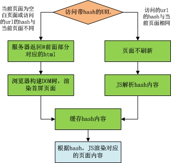
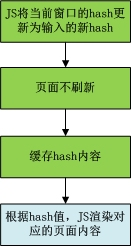
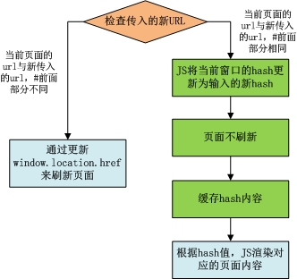

页面无刷新切换至少需要解决下面两个问题：页面切换不刷新浏览器；每个切换的页面有对应的URL（也可以到更细粒度的页面状态），页面和URL一个变化时，另一个也做对应的变化（包括点击浏览器回退）。它是实现单页应用的基础，在很多框架(库)中被称为“路由器系统”。

## 控制浏览器刷新
通常情况下，当URL变化时，浏览器会根据新URL发送HTTP请求，然后页面也随着自动刷新。这个问题可以通过URL的hash来解决（即URL中包含#号），#后面的部分是URL的hash，当#前面的部分不变而后面的部分改变时，浏览器既不会发送HTTP请求，也不会刷新页面（如果不考虑兼容IE8及以下版本，则可以用EMACScript5的history.pushState方式）。
## 浏览器回退
当通过修改URL.hash的方式来达到URL变化目的时，虽然点击浏览器回退，URL也会变化，但是因为#号的缘故，浏览器会不自动刷新到对应的页面。可以定义window的hashchange事件，当URL变化时，会触发这个事件，然后在这个事件中执行新页面渲染的操作。（IE7及其以下的版本不支持hashchange事件，可以通过setInterval定时检查hash的变化）。
** 应用场景 **
### (1) 直接通过访问带hash的URL进入对应页面
这一场景出现在通过URL首次进入页面或刷新页面时。流程见下图。

上面流程中，“缓存hash内容”的目的是记录当前页面hash，当浏览器回退时，若hash有变化，则会触发window的hashchange事件，JS比较回退后的hash与缓存的hash是否一致，若不一致，则会根据回退后的hash来渲染对应的JS页面。
### (2) 修改hash进入对应页面
这一场景出现在点击DOM节点切换页面，或直接执行JS代码，通过修改hash切换页面。流程见下图。

上图中的最后一步“JS渲染的新页面的内容”，有可能是全新的页面，也有可能只是页面的局部。渲染策略可灵活控制，既可以是将整个页面渲染，也可以是只渲染局部，新页面显示后，旧页面可以是从DOM树中移除，也可以是隐藏。
上图中的流程执行完后，其中有一步修改过窗口的hash，因此上图流程执行完成后会触发window的hashchange事件，但是第3步将缓存的hash更新成了当前窗口的hash，因此hashchange事件不会触发页面渲染操作。
###  (3) 点击含href属性的链接进入对应页面
这一场景是为实现点击链接切换页面时，新页面是在弹出的新浏览器窗口中显示。因此链接会设置href属性，用户可以点右键打开新窗口，或者直接设置链接的target为_blank。但是为了实现上面场景中提到的页面的灵活渲染策略，通过点击href来变化浏览器的url是不够的，往往还是要在链接上绑定JS的点击事件，在点击事件中执行场景2的步骤。

